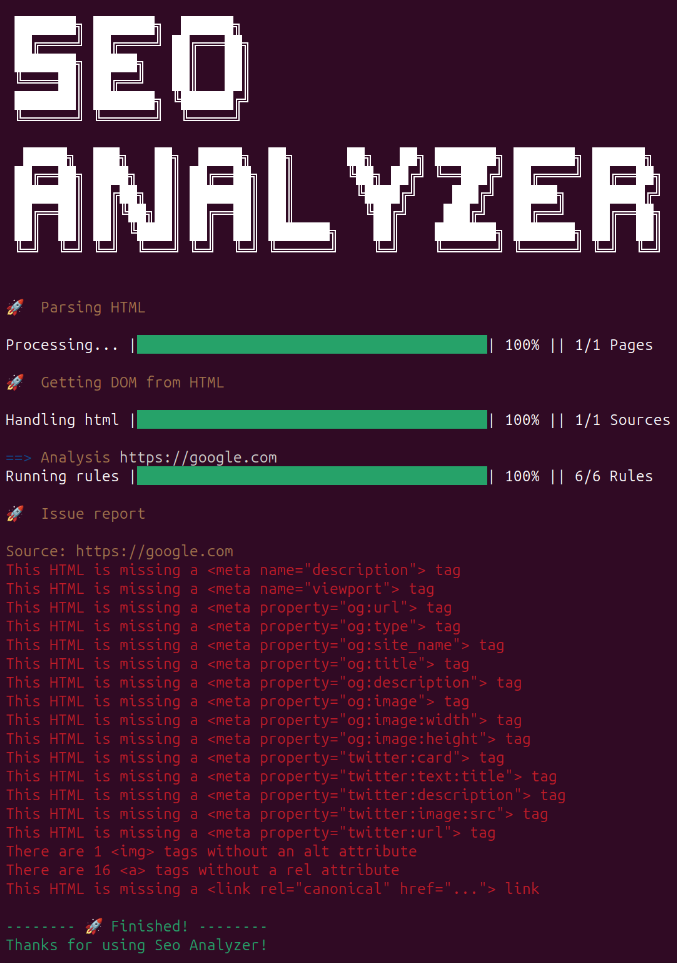

# SEO analyzer — library for searching SEO issues

[](https://maddevs.io?utm_source=github&utm_medium=madboiler) [](https://opensource.org/licenses/MIT)



The library for analyze a HTML files to show all of the SEO defects.

## Translations of documentation

- English
- [Russian](./README_RU.md)

## Advantages of this plugin

- Easy setup.
- Adding custom rules.
- 6 ready-made rules.
- Running the seo-analyzer for SSR applications.
- Running the seo-analyzer for SPA applications.
- Running the seo-analyzer in pipelines(github, gitlab, ...) or pre-push or anywhere else.
- Multiple options for outputting the result.

## Why you should use Seo Analyzer

- **Saves time:** will save you from manually searching for seo problems.
- **Seo Friendly:** will save your project from problems with search engines.
- **It’s free:** we’re happy to share the results of our work.

## How to use the CLI

To use the CLI, you must install the package globally.

```sh
npm install -g seo-analyzer
```

### Usage

```sh
seo-analyzer -h
```

| Option | Args | Description |
| --- | --- | --- |
| -h, --help | null | Show all options. |
| -v, --version | null | **Display Application Version:** Displays the current version of the application. |
| -iu, --ignoreUrls | [array] | **Exclude Specific URLs from Analysis:** Excludes certain URLs from analysis to avoid processing unwanted web pages. |
| -if, --ignoreFiles | [array] | **Exclude Specific Files from Analysis:** Allows excluding certain files from analysis, preventing their processing. |
| -ifl, --ignoreFolders | [array] | **Exclude Specific Folders from Analysis:** Excludes specified folders from the analysis process, ignoring all files within those folders. |
| -u, --urls | [array] | **Perform SEO Analysis on Specified URLs:** Conducts SEO analysis for specified URLs, checking their compliance with certain SEO criteria. |
| -f, --files | [array] | **Perform SEO Analysis on Specified Files:** Performs SEO analysis on specified files, ensuring their adherence to optimization standards and rules. |
| -fl, --folder | [array] | **Perform SEO Analysis on Specified Folders:** Analyzes all files within specified folders for compliance with SEO rules and recommendations. |
| -r, --rules | [array] | **Apply Specific SEO Rules for Analysis:** Applies specific SEO rules during analysis, allowing the user to customize the inspection process. By default run all default rules. |

#### Example of using multiple url analysis

```sh
seo-analyzer -u https://maddevs.io https://maddevs.io/blog
```

#### Example of using rules

```sh
seo-analyzer -u https://maddevs.io -r titleLengthRule='{ "min": "500" }'
```

Use json format to pass parameters to the rule.

## How to use as github action

To use SEO analyzer as actions on github, you can create a workflow file in .github/workflows/analyzer.yml with the following content:

```yml
name: SEO analyzer

on: [push]

jobs:
  seo-analyzer:
    runs-on: ubuntu-latest
    steps:
      - uses: actions/checkout@v4
      - name: Use Node.js
        uses: actions/setup-node@v4
        with:
          node-version: '20.x'
      - run: npm i -g seo-analyzer
      - run: seo-analyzer -u https://maddevs.io
```

In the last step, you can specify the url you want to analyse.

## How to use as API

Install to the project.

```sh
npm install -D seo-analyzer
```

## Usage

### Getting started

Setting up the SEO analyzer is as simple as possible. It will look something like this:

```js
const SeoAnalyzer = require('seo-analyzer');

new SeoAnalyzer()
  .inputFiles(<array>)
  .addRule(<function>)
  .addRule(<function>)
  .outputConsole()
  .run();
```

Next I will show you some examples.

#### One way: analyze the url list and output the report to the console

```js
const SeoAnalyzer = require('seo-analyzer');

new SeoAnalyzer()
  .inputUrls(['https://maddevs.io', 'https://maddevs.io/blog'])
  .addRule('imgTagWithAltAttributeRule')
  .outputConsole()
  .run();
```

#### Two way: file analysis for SPA application and log report to console

```js
const SeoAnalyzer = require('seo-analyzer');

new SeoAnalyzer()
  .ignoreUrls(['/404', '/login'])
  .inputSpaFolder('/dist', 'sitemapindex.xml', 3000)
  .addRule('imgTagWithAltAttributeRule')
  .outputConsole()
  .run();
```

#### Three way: read a list HTML files and log report to console

```js
const SeoAnalyzer = require('seo-analyzer');

new SeoAnalyzer()
  .inputFiles(['index.html', 'about.html'])
  .addRule('imgTagWithAltAttributeRule')
  .outputConsole();
```

#### Fourth way: read a folders with HTML files and log report to console

```js
const SeoAnalyzer = require('seo-analyzer');

new SeoAnalyzer()
  .inputFolders(['dist', 'src'])
  .addRule('imgTagWithAltAttributeRule')
  .outputConsole()
  .run();
```

#### Fifth way: read a folders with HTML files and return json

```js
const SeoAnalyzer = require('seo-analyzer');

new SeoAnalyzer()
  .inputFolders(['dist', 'src'])
  .addRule('imgTagWithAltAttributeRule')
  .outputJson(json => console.log(json))
  .run();
```

#### Sixth way: ignore subfolder "test" and 404.html in folder "src" and return js object

```js
const SeoAnalyzer = require('seo-analyzer');

new SeoAnalyzer()
  .ignoreFolders(['src/test'])
  .ignoreFiles(['src/404.html'])
  .inputFolders(['dist', 'src'])
  .addRule('imgTagWithAltAttributeRule')
  .outputObject(obj => console.log(obj))
  .run();
```

#### Seventh way: Input an HTML string directly and log report to console

```js
const SeoAnalyzer = require('seo-analyzer');

new SeoAnalyzer()
  .inputHTMLString(
    '<!DOCTYPE html><html><body><h1>title</h1><p>content</p></body></html>'
  )
  .addRule('imgTagWithAltAttributeRule')
  .outputConsole()
  .run();
```

## Available methods:

| Method | Params | Description |
| --- | --- | --- |
| ignoreFiles | ['dist/about.html'] | This method expects an array of files to ignore before analysis. |
| ignoreFolders | ['dist/ignore'] | This method expects an array of folders to ignore before analysis. |
| ignoreUrls | ['/404'] | This method expects an array of urls to ignore before analysis. |
| inputFiles | ['dist/index.html'] | This method expects an array of html files. |
| inputUrls | ['https://maddevs.io'] | This method expects an array of urls to analyze. |
| inputFolders | ['dist', 'src'] | This method expects an array of folders with html files. |
| inputSpaFolder | '/dist', 'sitemap.xml', 3000 | This method expects an string of folder with SPA builded files to production & port for run server. |
| inputHTMLString | ['<html>example</html>'] | This method expects a string containing HTML. |
| addRule | function(dom) {} | This method adds a custom rule to check incoming HTML files. |
| outputObject | function(obj) {} | This method will return the report as a javascript object. |
| outputJson | function(json) {} | This method will return the report in JSON format. |
| outputConsole | null | This method must be used at the very end of the chain, because it completes the process in the console. |

## List of rules that are available by default

Below are the rules that are executed for each file transferred to Seo Analyzer. They are disabled by default and must be added.

### Title Length Rule

Checks the length of tag `<title>`. Two parameters are accepted:

- **min:** minimum length of the header
- **max:** maximum length of the header

```js
.addRule('titleLengthRule', { min: 10, max: 50 })
```

### Img Tag With Alt Attribute Rule

Checks if all `` tags have alt="" attribute.

```js
.addRule('imgTagWithAltAttributeRule')
```

### `<a>` Tag With Rel Attribute Rule

Checks if all `<a>` tags have rel="" attribute.

```js
.addRule('aTagWithRelAttributeRule')
```

### Meta Base Rule

Checks if the specified **basic** meta tags are present on the page. Accepts one parameter:

- **list:** list of required meta tags

```js
.addRule('metaBaseRule', { list: ['description', 'viewport'] })
```

### Meta Social Rule

Checks if the specified **social** meta tags are present on the page. Accepts one parameter:

- **properties:** list of required meta tags

```js
.addRule('metaSocialRule', {
  properties: [
    'og:url',
    'og:type',
    'og:site_name',
    'og:title',
    'og:description',
    'og:image',
    'og:image:width',
    'og:image:height',
    'twitter:card',
    'twitter:text:title',
    'twitter:description',
    'twitter:image:src',
    'twitter:url'
  ],
})
```

### Canonical Link Rule

Checks if a canonical link exists on the page.

```js
.addRule('canonicalLinkRule')
```

### Add custom rule

A custom rule is a function that takes a DOM tree argument.

```js
function customRule(dom) {
  return new Promise(async (resolve, reject) => {
    const paragraph = dom.window.document.querySelector('p');
    if (paragraph) {
      resolve('');
    } else {
      reject('Not found <p> tags');
    }
  });
}

...
.addRule(customRule)
...
```

## Example of the output of all SEO defects in the console.

```bash
 ███████╗ ███████╗  ██████╗
 ██╔════╝ ██╔════╝ ██╔═══██╗
 ███████╗ █████╗   ██║   ██║
 ╚════██║ ██╔══╝   ██║   ██║
 ███████║ ███████╗ ╚██████╔╝
 ╚══════╝ ╚══════╝  ╚═════╝

  █████╗  ███╗   ██╗  █████╗  ██╗      ██╗   ██╗ ███████╗ ███████╗ ██████╗
 ██╔══██╗ ████╗  ██║ ██╔══██╗ ██║      ╚██╗ ██╔╝ ╚══███╔╝ ██╔════╝ ██╔══██╗
 ███████║ ██╔██╗ ██║ ███████║ ██║       ╚████╔╝    ███╔╝  █████╗   ██████╔╝
 ██╔══██║ ██║╚██╗██║ ██╔══██║ ██║        ╚██╔╝    ███╔╝   ██╔══╝   ██╔══██╗
 ██║  ██║ ██║ ╚████║ ██║  ██║ ███████╗    ██║    ███████╗ ███████╗ ██║  ██║
 ╚═╝  ╚═╝ ╚═╝  ╚═══╝ ╚═╝  ╚═╝ ╚══════╝    ╚═╝    ╚══════╝ ╚══════╝ ╚═╝  ╚═╝


🚀  Parsing HTML

Processing... |████████████████████████████████████████| 100% || 1/1 Pages

🚀  Getting DOM from HTML

Handling html |████████████████████████████████████████| 100% || 1/1 Sources

==> Analysis https://google.com
Running rules |████████████████████████████████████████| 100% || 6/6 Rules

🚀  Issue report

Source: https://google.com
This HTML is missing a <meta name="description"> tag
This HTML is missing a <meta name="viewport"> tag
This HTML is missing a <meta property="og:url"> tag
This HTML is missing a <meta property="og:type"> tag
This HTML is missing a <meta property="og:site_name"> tag
This HTML is missing a <meta property="og:title"> tag
This HTML is missing a <meta property="og:description"> tag
This HTML is missing a <meta property="og:image"> tag
This HTML is missing a <meta property="og:image:width"> tag
This HTML is missing a <meta property="og:image:height"> tag
This HTML is missing a <meta property="twitter:card"> tag
This HTML is missing a <meta property="twitter:text:title"> tag
This HTML is missing a <meta property="twitter:description"> tag
This HTML is missing a <meta property="twitter:image:src"> tag
This HTML is missing a <meta property="twitter:url"> tag
There are 1  tags without an alt attribute
There are 16 <a> tags without a rel attribute
This HTML is missing a <link rel="canonical" href="..."> link

-------- 🚀 Finished! --------
Thanks for using Seo Analyzer!
```

or

```bash
👍 SEO defects were not detected.
```

## Licensing

MIT License

Copyright (c) 2024 Mad Devs

Permission is hereby granted, free of charge, to any person obtaining a copy of this software and associated documentation files (the "Software"), to deal in the Software without restriction, including without limitation the rights to use, copy, modify, merge, publish, distribute, sublicense, and/or sell copies of the Software, and to permit persons to whom the Software is furnished to do so, subject to the following conditions:

The above copyright notice and this permission notice shall be included in all copies or substantial portions of the Software.

THE SOFTWARE IS PROVIDED "AS IS", WITHOUT WARRANTY OF ANY KIND, EXPRESS OR IMPLIED, INCLUDING BUT NOT LIMITED TO THE WARRANTIES OF MERCHANTABILITY, FITNESS FOR A PARTICULAR PURPOSE AND NONINFRINGEMENT. IN NO EVENT SHALL THE AUTHORS OR COPYRIGHT HOLDERS BE LIABLE FOR ANY CLAIM, DAMAGES OR OTHER LIABILITY, WHETHER IN AN ACTION OF CONTRACT, TORT OR OTHERWISE, ARISING FROM, OUT OF OR IN CONNECTION WITH THE SOFTWARE OR THE USE OR OTHER DEALINGS IN THE SOFTWARE.
