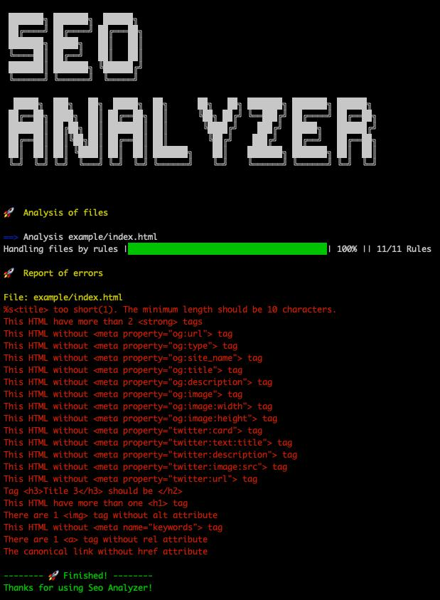

# SEO анализатор - библиотека для поиска SEO ошибок

[](https://maddevs.io?utm_source=github&utm_medium=madboiler)
[](https://opensource.org/licenses/MIT)



SEO анализатор это инструмент, который поможет отлавливать SEO дефекты на разных стадиях разработки. Основная задача — анализ DOM дерева с целью обнаружения SEO дефектов.

**Ссылка на статью** https://medium.com/maddevs-io/seo-analyzer-bfb0eea16801

## Переводы документации

- [English](./README.md)
- Russian

## Преимущества этого плагина

* Простая настройка.
* Добавление собственных правил.
* 6 готовых и популярных правил.
* Запуск анализатора для Next.js SSR приложений.
* Запуск анализатора для SPA приложений.
* Запуск анализатора в конвейерах (github, gitlab, ...), pre-push и т.д.
* Несколько вариантов вывода результата.

## Почему вам следует использовать Seo Analyzer?

* **Экономит время:** избавит вас от ручного поиска проблем, которые влияют на поисковую оптимизацию.
* **Seo Friendly:** держит ваш проект валидным и дружелюбным к поисковым роботам путём обнаружения дефектов на страницах вашего сайта.
* **Это бесплатно:** мы рады поделиться результатами своей работы.

## Установка

Установка с помощью npm

```sh
npm install -D seo-analyzer
```

## Применение
### Начало

Настройка SEO анализатора максимально проста. Выглядеть она будет примерно так:

```js
const SeoAnalyzer = require('seo-analyzer');

new SeoAnalyzer()
  .inputFiles(<array>)
  .addRule(<function>)
  .addRule(<function>)
  .outputConsole();
```

Далее покажу несколько примеров.

#### Способ №1: анализ страниц для SPA приложения и вывод отчета в консоль

```js
const SeoAnalyzer = require('seo-analyzer');

new SeoAnalyzer()
  .ignoreUrls(['/404', '/login'])
  .inputSpaFolder('/dist', 'sitemap.xml', 3000)
  .addRule('imgTagWithAltAttributeRule')
  .outputConsole();
```

#### Способ №2: анализ список HTML-файлов и вывод отчета в консоль

```js
const SeoAnalyzer = require('seo-analyzer');

new SeoAnalyzer()
  .inputFiles(['index.html', 'about.html'])
  .addRule('imgTagWithAltAttributeRule')
  .outputConsole();
```

#### Способ №3: анализ папок с HTML-файлами и вывод отчета в консоль

```js
const SeoAnalyzer = require('seo-analyzer');

new SeoAnalyzer()
  .inputFolders(['dist', 'src'])
  .addRule('imgTagWithAltAttributeRule')
  .outputConsole();
```

#### Способ №4: анализ папок с HTML-файлами и вывод отчета в виде JSON

```js
const SeoAnalyzer = require('seo-analyzer');

new SeoAnalyzer()
  .inputFolders(['dist', 'src'])
  .addRule('imgTagWithAltAttributeRule')
  .outputJson(json => console.log(json));
```

#### Способ №5: игнорировать подпапку "test" и 404.html в папке "src" и вернуть объект js

```js
const SeoAnalyzer = require('seo-analyzer');

new SeoAnalyzer()
  .ignoreFolders(['src/test'])
  .ignoreFiles(['src/404.html'])
  .inputFolders(['dist', 'src'])
  .addRule('imgTagWithAltAttributeRule')
  .outputObject(obj => console.log(obj));
``` 

#### Способ №6: анализ страниц для Next.js SSR приложения и вывод отчета в консоль

```js
const SeoAnalyzer = require('seo-analyzer');

new SeoAnalyzer()
  .inputNextJs('sitemap-index.xml', 3000)
  .addRule('imgTagWithAltAttributeRule')
  .outputConsole();
```

## Доступные методы:

| Метод          | Параметры            | Описание                                                                                                |
|----------------|----------------------|---------------------------------------------------------------------------------------------------------|
| ignoreFiles    | ['dist/about.html']  | Массив файлов, которые будут проигнорированны во время анализа. |
| ignoreFolders  | ['dist/ignore']      | Массив папок с файлами, которые будут проигнорированны во время анализа. |
| ignoreUrls     | ['/404']             | Массив URL-адресов, которые будут проигнорированны во время анализа. |
| inputFiles     | ['dist/index.html']  | Массив файлов, которые нужно анализировать. |
| inputFolders   | ['dist', 'src']      | Массив папкок с файлами, которые нужно анализировать. |
| inputSpaFolder | '/dist', 'sitemap.xml', 3000        | Метод для запуска анализаторв для SPA приложений. Ожидает папку с финальными кодом приложения и порт на котором запустится анализатор. |
| inputNextJs    | 'sitemap.xml', 3000                 | Метод для запуска анализаторв для Next.js SSR приложений. Ожидает порт для запуска Next.js сервера.                                                       |
| addRule        | function(dom) {}     | Метод для добавления встроенных правил или собственных. |
| outputObject   | function(obj) {}     | Метод для вывода результата. Вернёт js объект. |
| outputJson     | function(json) {}    | Метод для вывода результата. Вернёт JSON. |
| outputConsole  | null                 | Метод для вывода результата. Вернёт результат в консоль. Использовать только в самом конце цепочки, потому что он завершает процесс и цепочка методов ниже не сработает |

## Список правил, доступных по умолчанию

Ниже приведены правила, которые выполняются для каждого файла передаваемого в Seo Analyzer. По умолчанию они отключены и должны быть добавлены.

### Правило длины заголовка

Проверяет длину тега `<title>`. Принимаются два параметра:
 
* **min:** минимальная длина заголовка
* **max:** максимальная длина заголовка

```js
.addRule('titleLengthRule', { min: 10, max: 50 })
```

### Правило теги Img с атрибутом Alt

Проверяет, все ли теги `` имеют текст в атрибуте `alt=""`.

```js
.addRule('imgTagWithAltAttributeRule')
```

### `<a>` Правило тега `<a>` с атрибутом Rel

Проверяет, все ли теги `<a>` имеют атрибут `rel=""`

```js
.addRule('aTagWithRelAttributeRule')
```

### Правило метаданных

Проверяет, присутствуют ли на странице указанные **базовые** мета-теги. Принимает один параметр:

* **list:** список необходимых метатегов

```js
.addRule('metaBaseRule', { list: ['description', 'viewport'] })
```

### Правило мета-тегов для социальных сетей

Проверяет, присутствуют ли на странице указанные **социальные** мета-теги. Принимает один параметр:

* **properties:** список необходимых мета-тегов

```js
.addRule('metaSocialRule', {
  properties: [
    'og:url',
    'og:type',
    'og:site_name',
    'og:title',
    'og:description',
    'og:image',
    'og:image:width',
    'og:image:height',
    'twitter:card',
    'twitter:text:title',
    'twitter:description',
    'twitter:image:src',
    'twitter:url'
  ], 
})
```

### Правило канонической ссылки

Проверяет, существует ли на странице каноническая ссылка.

```js
.addRule('canonicalLinkRule')
```

### Добавить собственное правило

Пользовательское правило - это всего лишь функция, которая принимает один аргумент в виде DOM дерева.

```js
function customRule(dom) {
  return new Promise(async (resolve, reject) => {
    const paragraph = dom.window.document.querySelector('p');
    if (paragraph) {
      resolve('');
    } else {
      reject('Not found <p> tags');
    }
  });
}

...
.addRule(customRule)
...
```

## Что нового
Было добавлено одно новое правило и удалено 3 устаревших.

✅: добавлено\
❌: удалено

| ✅ | ❌ | Rule | Description |
| :---: | :---: | :--- | :--- |
| ✅  |  | inputNextJs | Запуск анализатора для Next.js SSR приложений |
|    |❌ | hTagsRule | Только для HTML4 |
|    |❌ | noMoreThanOneH1TagRule | Только для HTML4 |
|    |❌ | noTooManyStrongTagsRule | Только для HTML4|


## Пример вывода отчета в консоль.

```bash

 ███████╗ ███████╗  ██████╗
 ██╔════╝ ██╔════╝ ██╔═══██╗
 ███████╗ █████╗   ██║   ██║
 ╚════██║ ██╔══╝   ██║   ██║
 ███████║ ███████╗ ╚██████╔╝
 ╚══════╝ ╚══════╝  ╚═════╝

  █████╗  ███╗   ██╗  █████╗  ██╗      ██╗   ██╗ ███████╗ ███████╗ ██████╗
 ██╔══██╗ ████╗  ██║ ██╔══██╗ ██║      ╚██╗ ██╔╝ ╚══███╔╝ ██╔════╝ ██╔══██╗
 ███████║ ██╔██╗ ██║ ███████║ ██║       ╚████╔╝    ███╔╝  █████╗   ██████╔╝
 ██╔══██║ ██║╚██╗██║ ██╔══██║ ██║        ╚██╔╝    ███╔╝   ██╔══╝   ██╔══██╗
 ██║  ██║ ██║ ╚████║ ██║  ██║ ███████╗    ██║    ███████╗ ███████╗ ██║  ██║
 ╚═╝  ╚═╝ ╚═╝  ╚═══╝ ╚═╝  ╚═╝ ╚══════╝    ╚═╝    ╚══════╝ ╚══════╝ ╚═╝  ╚═╝


🚀  Analysis of files

==> Analysis example/index.html
Handling files by rules |████████████████████████████████████████| 100% || 11/11 Rules

🚀  Report of errors

File: example/index.html
<title> too short(1). The minimum length should be 10 characters.
This HTML have more than 2 <strong> tags
This HTML without <meta property="og:url"> tag
This HTML without <meta property="og:type"> tag
This HTML without <meta property="og:site_name"> tag
This HTML without <meta property="og:title"> tag
This HTML without <meta property="og:description"> tag
This HTML without <meta property="og:image"> tag
This HTML without <meta property="og:image:width"> tag
This HTML without <meta property="og:image:height"> tag
This HTML without <meta property="twitter:card"> tag
This HTML without <meta property="twitter:text:title"> tag
This HTML without <meta property="twitter:description"> tag
This HTML without <meta property="twitter:image:src"> tag
This HTML without <meta property="twitter:url"> tag
Tag <h3>Title 3</h3> should be </h2>
This HTML have more than one <h1> tag
There are 1  tag without alt attribute
This HTML without <meta name="keywords"> tag
There are 1 <a> tag without rel attribute
The canonical link without href attribute

-------- 🚀 Finished! --------
Thanks for using Seo Analyzer!
```

or

```bash
👍 SEO defects were not detected.
```

## Лицензирование

Лицензия MIT

Авторское право (c) 2021 Mad Devs

Настоящим предоставляется бесплатное разрешение любому лицу, получившему копию этого программного обеспечения и связанных файлов документации («Программное обеспечение»), на работу с Программным обеспечением без ограничений, включая, помимо прочего, права на использование, копирование, изменение, объединение, публикацию, распространение, сублицензирование и/или продажу копии Программного обеспечения и разрешение лицам, которым предоставляется Программное обеспечение, делать это при соблюдении следующих условий:

Вышеупомянутое уведомление об авторских правах и это уведомление о разрешении должны быть включены во все копии или существенные части Программного обеспечения.

ПРОГРАММНОЕ ОБЕСПЕЧЕНИЕ ПРЕДОСТАВЛЯЕТСЯ «КАК ЕСТЬ», БЕЗ КАКИХ-ЛИБО ГАРАНТИЙ, ЯВНЫХ ИЛИ ПОДРАЗУМЕВАЕМЫХ, ВКЛЮЧАЯ, НО НЕ ОГРАНИЧИВАЯСЬ, ГАРАНТИИ КОММЕРЧЕСКОЙ ПРИГОДНОСТИ, ПРИГОДНОСТИ ДЛЯ ОПРЕДЕЛЕННОЙ ЦЕЛИ И НЕЗАЩИТЫ ОТ ПРАКТИКИ. НИ ПРИ КАКИХ ОБСТОЯТЕЛЬСТВАХ АВТОРЫ ИЛИ ВЛАДЕЛЬЦЫ АВТОРСКИХ ПРАВ НЕ НЕСУТ ОТВЕТСТВЕННОСТИ ЗА ЛЮБЫЕ ПРЕТЕНЗИИ, УБЫТКИ ИЛИ ДРУГИЕ ОТВЕТСТВЕННОСТИ, КОТОРЫЕ ВОЗНИКЛИ В РЕЗУЛЬТАТЕ ДОГОВОРА, ПРАКТИЧЕСКИХ ПРАВ ИЛИ ИНЫХ СЛУЧАЕВ, ВНУТРИ ИЛИ В СВЯЗИ С ПРОГРАММНЫМ ОБЕСПЕЧЕНИЕМ ИЛИ ИСПОЛЬЗОВАНИЕМ ИЛИ ДРУГИМИ ДЕЙСТВИЯМИ С ПРОГРАММНЫМ ОБЕСПЕЧЕНИЕМ.

